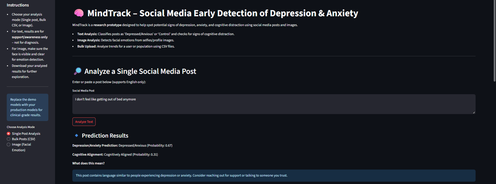
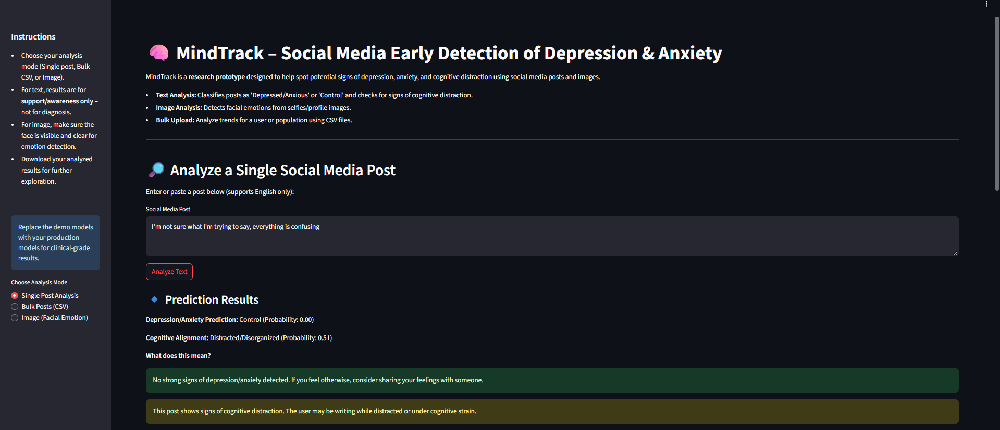

# MindTrack: Social Media Early Detection of Depression & Anxiety

**MindTrack** is an interactive, research-focused application built using [Streamlit](https://streamlit.io/). The project aims to identify early signals of depression, anxiety, and cognitive distraction from social media posts using Natural Language Processing (NLP) and Machine Learning (ML) models.

> **Note:**  
> This is an early-stage prototype. Currently, the model is trained for **single social media post analysis only**. Features for analyzing bulk posts (CSV files) and facial images (emotion detection) are under active development.

---

## 🚀 Features

- **Single Post Analysis:**  
  Enter a social media post and receive instant predictions on:
  - Depression/Anxiety risk
  - Cognitive alignment (clear vs. distracted/disorganized thought)
  - Probability scores for each prediction
  - Visual word cloud from your post

- **User-Friendly Interface:**  
  Easy-to-use UI with instructions, demo examples, and contextual explanations for results.

- **Educational Focus:**  
  Designed as a research and awareness tool, not a diagnostic platform.

---


---

## 🛠️ Installation & Requirements

> **Quick Start:**  
> You can run this project right away in the provided **GitHub Codespace**, with all dependencies pre-installed.  
> Otherwise, follow the steps below for manual setup:

1. **Clone the repository:**
    ```bash
    git clone https://github.com/yourusername/mindtrack.git
    cd mindtrack
    ```

2. **Install dependencies:**
    ```bash
    pip install streamlit pandas numpy matplotlib wordcloud scikit-learn deepface
    ```

3. **Run the app:**
    ```bash
    streamlit run mindtrack.py
    ```

---

## 🧰 Libraries & Technologies

- [Streamlit](https://streamlit.io/) — for interactive web UI
- [pandas](https://pandas.pydata.org/) — data handling
- [numpy](https://numpy.org/) — numerical computations
- [matplotlib](https://matplotlib.org/) — plots and visualizations
- [wordcloud](https://github.com/amueller/word_cloud) — word cloud generation
- [scikit-learn](https://scikit-learn.org/) — ML algorithms (Random Forest, Logistic Regression, TF-IDF)
- [DeepFace](https://github.com/serengil/deepface) — (future) emotion recognition from images

---

## 📝 Usage

- **Single Post Analysis:**
  - Select "Single Post Analysis" in the sidebar.
  - Paste a social media post (English only) and click "Analyze Text".
  - View predictions, explanations, and a word cloud.

- **Planned Features:**
  - Bulk post analysis via CSV upload (in development)
  - Image-based facial emotion analysis (in development)

---

## 📈 Example Output

- **Depression/Anxiety Prediction:**  
  _"Depressed/Anxious" (Probability: 0.67)_
  

- **Cognitive Alignment:**  
  _"Distracted/Disorganized" (Probability: 0.51)_
  

- **Word Cloud:**  
  


---


## 🔭 Roadmap

- [x] Single post depression/anxiety analysis (NLP)
- [ ] Bulk post (CSV) analysis
- [ ] Image-based emotion detection

---


